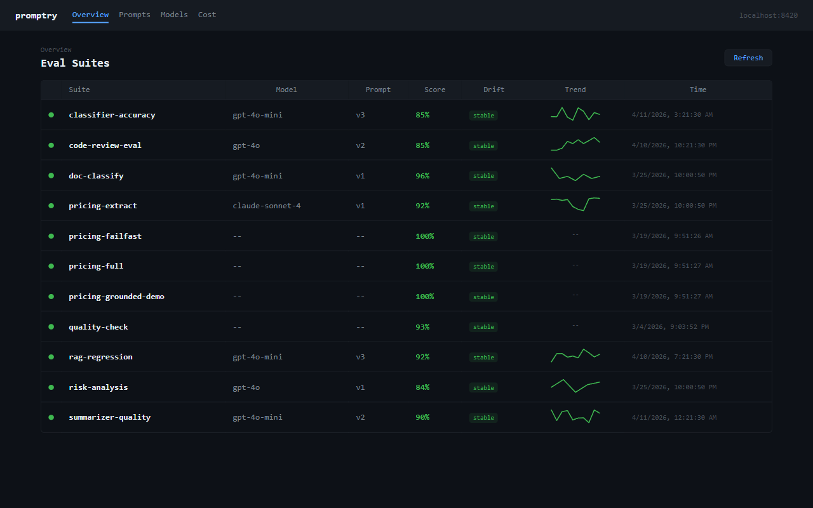
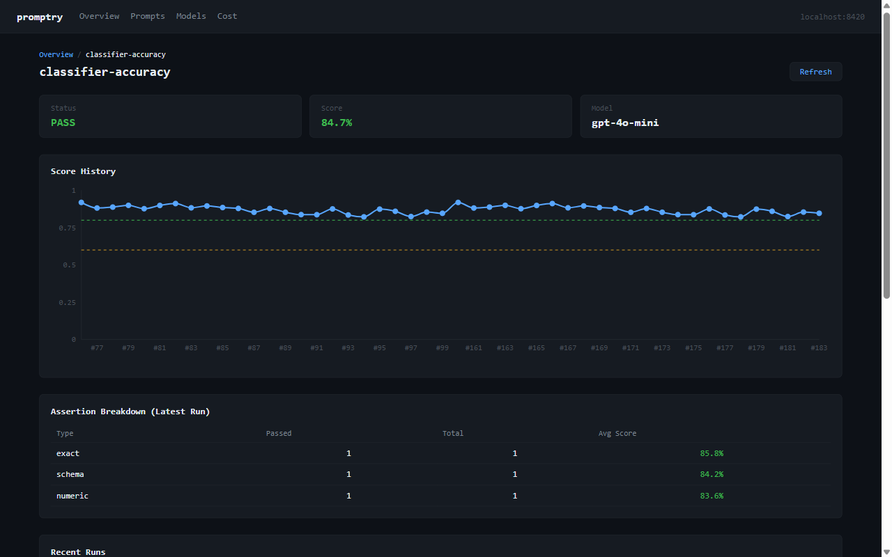
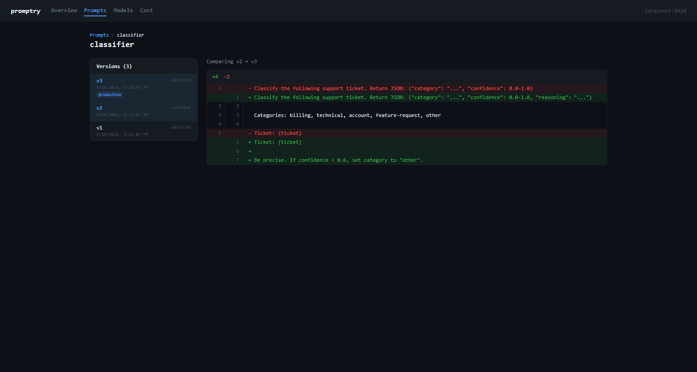
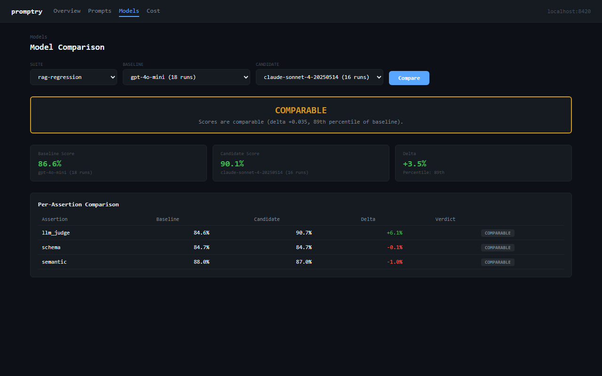
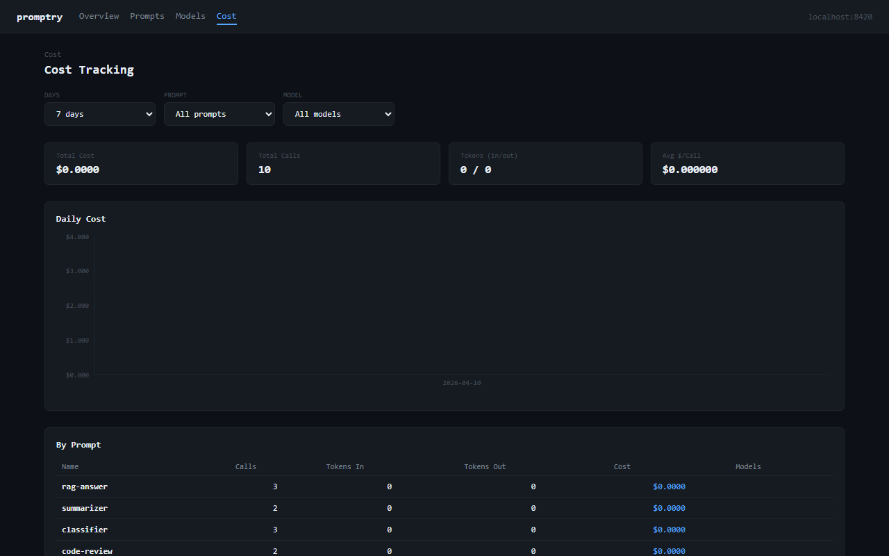

# promptry

[](https://pypi.org/project/promptry/)
[](https://www.npmjs.com/package/promptry-js)
[](https://github.com/bihanikeshav/promptry/actions/workflows/ci.yml)
[](https://python.org)
[](LICENSE)

**Sentry for prompts.** Sentry catches when your code breaks. promptry catches when your prompts break — versions them, runs eval suites in CI, and flags regressions or drift against a baseline. Local-first. No SaaS.

```python
from promptry import track, suite, assert_semantic

# track() content-hashes your prompt and stores a new version if it changed
prompt = track(system_prompt, "rag-qa")
response = llm.chat(system=prompt, ...)

# suites are regular Python functions. run them via CLI or in CI.
@suite("rag-regression")
def test_quality():
    response = my_pipeline("What is photosynthesis?")
    assert_semantic(response, "Converts light into chemical energy")
```

When a suite regresses against its baseline, promptry reports **what** changed:

```
Overall score: 0.910 -> 0.720  REGRESSION

Probable cause:
  -> Prompt changed (v3 -> v4)
```

## Install

```bash
pip install promptry                       # core
pip install promptry[semantic]             # + semantic assertions (sentence-transformers)
pip install promptry[dashboard]            # + web dashboard
pip install promptry[semantic,dashboard]   # everything
```

## Quick start

```bash
promptry init                              # scaffold project + starter eval
promptry run smoke-test --module evals     # run it
```

```
PASS test_basic_quality (142ms)
  semantic (0.891) ok

Overall: PASS  score: 0.891
```

## Features

| Feature | What it does |
|---------|--------------|
| **Prompt versioning** | Content-hashed, automatic dedup |
| **Eval suites** | Semantic, schema, LLM-as-judge, JSON, regex, grounding assertions |
| **Regression detection** | Compare against baselines, get root cause hints |
| **Drift detection** | Catch slow quality degradation over time |
| **Model comparison** | Statistical comparison against historical baseline (not just snapshots) |
| **Cost tracking** | Token usage and cost per prompt, aggregated reports |
| **Safety templates** | 25 starter jailbreak / injection / PII tests — add your own |
| **MCP server** | Expose everything as tools for Claude, Cursor, VS Code, etc. |
| **Dashboard** | Web UI for eval history, prompt diffs, model comparison, cost |
| **JS/TS client** | Ship prompt events from frontend/Node apps |

## Dashboard

```bash
pip install promptry[dashboard]
promptry dashboard
```







## How it differs

| | Promptfoo | DeepEval | RAGAS | LangSmith | **promptry** |
|---|---|---|---|---|---|
| **Language** | TypeScript | Python | Python | Python + JS | Python + JS |
| **Local-first** | Yes | Cloud push | Yes | SaaS only | SQLite |
| **Prompt versioning** | Via git + YAML | No | No | Prompt Hub | Automatic |
| **Drift over time** | No | No | No | Dashboards | Regression window |
| **Root cause hints** | No | No | No | No | Yes |
| **Safety / red-team** | Yes | Yes | No | No | 25 starters |
| **MCP server** | Plugin | Partial | No | No | Native |
| **Vendor** | OpenAI-owned | Independent | Independent | LangChain | Independent |
| **Cost** | Free | Freemium | Free | Freemium | Free |

Honest caveats: Promptfoo has more assertion types and a larger red-team corpus. RAGAS has the gold-standard RAG metrics (faithfulness, context precision, answer relevancy). LangSmith has better multi-user dashboards and deeper LangChain integration. promptry's niche is the combo of **local SQLite + automatic versioning + CI-native + MCP server** in one Python-first package.

## GitHub Action

Run eval suites in CI with one line. On pull requests it posts (or updates) a single comment summarizing the eval: overall score, pass/fail counts, and any regressed tests vs. the previous run. [View on Marketplace.](https://github.com/marketplace/actions/promptry-eval)

```yaml
# .github/workflows/eval.yml
name: Eval
on: [push, pull_request]
jobs:
  eval:
    runs-on: ubuntu-latest
    permissions:
      contents: read
      pull-requests: write  # required for PR comments
    steps:
      - uses: actions/checkout@v4
      - uses: bihanikeshav/promptry@v0.6.0
        with:
          suite: rag-regression
          module: evals
          compare: prod  # optional — compare against baseline
```

Example PR comment on a regression:

```markdown
## promptry eval: rag-regression

| | Current | Baseline | Delta |
|---|---|---|---|
| Overall score | 0.891 | 0.910 | -0.019 |
| Passed | 8/10 | 9/10 | -1 |
| Status | REGRESSED | PASS | |

**Regressions:**
- `test_photosynthesis_answer`: semantic 0.89 -> 0.72 (-0.17)
- `test_schema_validation`: passed -> **failed**

_Generated by [promptry](https://github.com/bihanikeshav/promptry)_
```

Subsequent pushes edit the same comment instead of spamming new ones.

| Input | Required | Default | Description |
|-------|----------|---------|-------------|
| `suite` | Yes | | Eval suite name |
| `module` | Yes | | Python module containing the suite |
| `compare` | No | | Baseline tag to compare against |
| `python-version` | No | `3.12` | Python version |
| `extras` | No | `semantic` | pip extras to install |
| `pr-comment` | No | `true` | Post/update a PR comment with results |
| `github-token` | No | `${{ github.token }}` | Token used to post PR comments |

## MCP server

```bash
claude mcp add promptry -- promptry mcp    # Claude Code
```

Works with Claude Desktop, Cursor, Windsurf, VS Code. See [full setup](docs/guide.md#mcp-server-llm-agent-integration).

## Documentation

The [full guide](docs/guide.md) covers all assertions, cost tracking, model comparison, safety templates, notifications, storage modes, JS client, CLI reference, MCP setup, and config options.

## Honest caveats

- **Early-stage.** v0.7, solo-maintained, small user base. API is stable but bus-factor is one. [Issues welcome.](https://github.com/bihanikeshav/promptry/issues)
- **"No API keys" applies to the framework only.** SQLite storage and the CLI need nothing. `assert_llm`, `assert_grounded`, and cost tracking all need your own LLM provider key.
- **Drift detection is a rolling-window regression on scores.** Works for steady degradation over a configurable window (default 30 runs). It is not a formal hypothesis test — see [drift detection docs](docs/guide.md#detect-drift) for exactly what it does and does not do.
- **Safety templates are starters, not comprehensive coverage.** 25 curated prompts across 6 categories. For serious red-teaming look at [garak](https://github.com/leondz/garak) or [PyRIT](https://github.com/Azure/PyRIT). Bring your own templates via `templates.toml`.
- **Cost tracking uses hardcoded rate tables.** Fine for rough estimates; won't reflect batching discounts, prompt caching, or provider price changes. Reconcile against invoices for finance.
- **Auto-instrumentation is opt-in.** `promptry.integrations.openai` and `.litellm` wrap clients automatically; otherwise you add `track()` manually. Explicit by default.
- **No hosted multi-user UI.** For that, look at LangSmith or Arize.

## License

MIT
